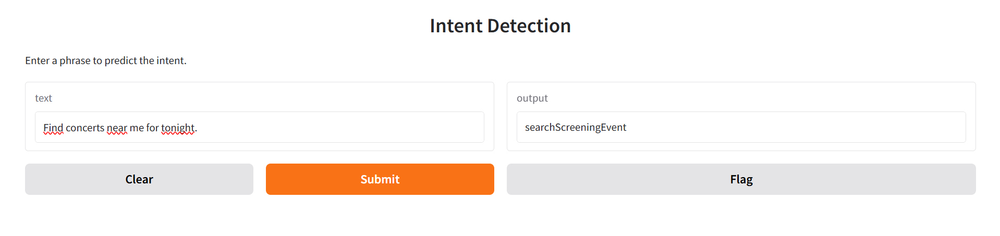
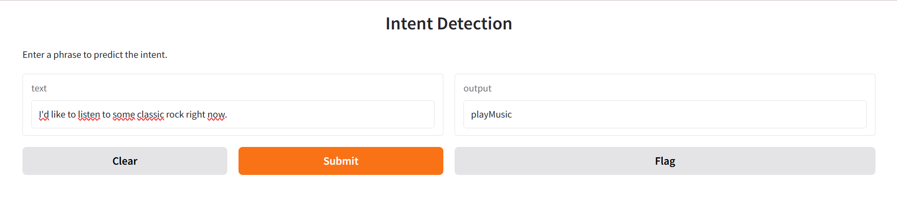
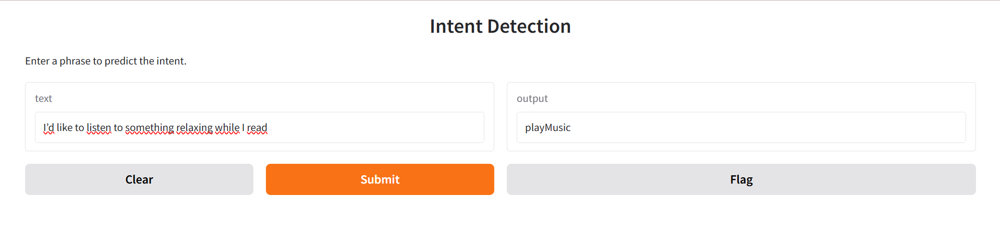
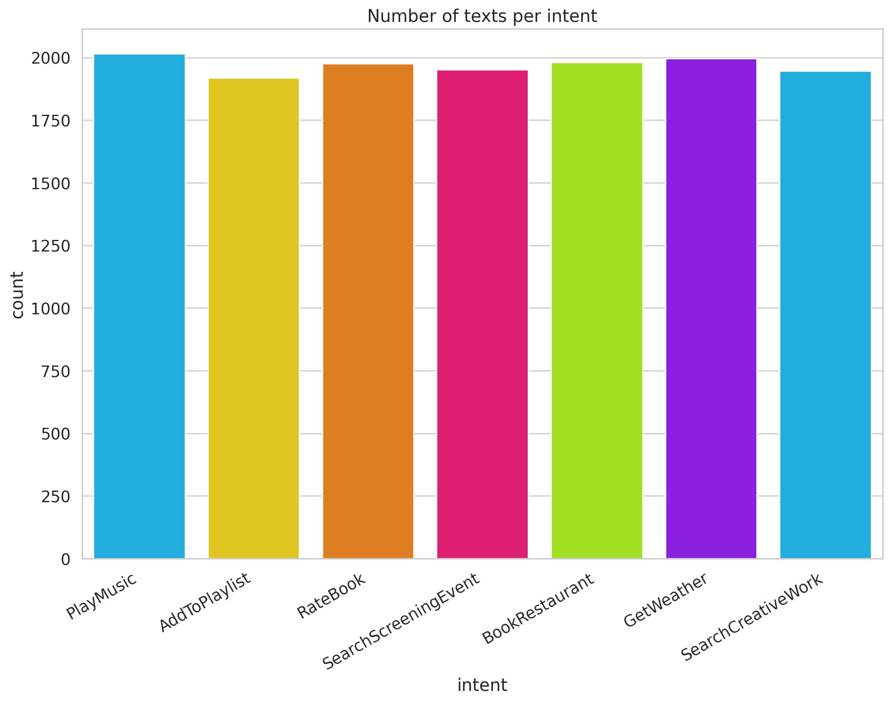

# Smart Intent Recognizer

AI-powered real-time intent recognition system built using **BERT, TensorFlow, Hugging Face Transformers, and Gradio**.
This project classifies user intents from natural language queries with strong contextual understanding, enabling smarter chatbots, virtual assistants, automation systems, and NLP applications.

---

## Project Overview

Smart Intent Recognizer is an advanced Natural Language Processing (NLP) system designed to accurately identify user intent from text input in real time.
Unlike traditional keyword-based systems, this project uses transformer-based deep learning to understand semantic meaning, sentence structure, and context.

The system is trained on the **SNIPS Dataset**, a widely used benchmark dataset for intent classification, covering multiple real-world intents such as:

* Play Music
* Book Flights
* Get Weather Information
* Search Creative Work
* Rate Books
* Add to Playlist
* Search Screening Event

---

## Key Features

### Real-Time Intent Prediction

* Predicts user intent instantly from natural language input
* Context-aware semantic understanding

### Fine-Tuned BERT Model

* Uses `bert-base-uncased` tokenizer and transformer architecture
* Strong NLP contextual embedding

### Interactive User Interface

* Built with Gradio for easy testing and deployment
* Simple, responsive web-based interface

### End-to-End ML Pipeline

* Dataset preprocessing
* Tokenization
* Model training
* Validation
* Deployment

### Scalable Architecture

* Can be expanded for multilingual NLP
* Suitable for chatbot systems, automation platforms, and enterprise NLP solutions

---

## Tech Stack

### Core Technologies

* Python
* TensorFlow / Keras
* Hugging Face Transformers
* BERT (`bert-base-uncased`)
* Pandas
* NumPy
* Scikit-learn
* Gradio

---

## System Architecture

```text
User Input
   ↓
Text Preprocessing
   ↓
BERT Tokenization
   ↓
Transformer-Based Contextual Embedding
   ↓
Intent Classification Model
   ↓
Predicted Intent Output
```

---

## Dataset Information

This project uses the **SNIPS Dataset**, containing thousands of labeled user utterances across multiple intent categories.

### Dataset Files:

```text
dataset/
│── train.csv
│── valid.csv
│── test.csv
```

### Why SNIPS?

* Balanced intent distribution
* Real-world query simulation
* Industry-standard benchmark for intent classification

---

## Installation Guide

### Step 1: Clone Repository

```bash
git clone https://github.com/Aayush-says/Smart_Intent_Recognizer_Official.git
cd Smart_Intent_Recognizer_Official
```

### Step 2: Create Virtual Environment

```bash
python -m venv venv
venv\Scripts\activate
```

### Step 3: Install Dependencies

```bash
pip install -r requirements.txt
```

---

## Model Training

To train the model from scratch:

```bash
python train_model.py
```

### Training Includes:

* Data loading
* Label mapping
* BERT tokenization
* Model building
* Fine-tuning
* Weight saving

### Output:

```text
intent_model.weights.h5
```

---

## Run the Application

```bash
python app.py
```

### Local Interface:

```text
http://127.0.0.1:7860
```

---

## Example Predictions

| User Query                | Predicted Intent |
| ------------------------- | ---------------- |
| Play some rock music      | playMusic        |
| Book me a flight to Delhi | bookFlight       |
| What’s the weather today? | getWeather       |
| Add this song to playlist | addToPlaylist    |

---

## Performance Highlights

### Benchmarks:

* High contextual prediction accuracy
* Real-time response
* BERT-based semantic understanding
* Smooth Gradio deployment

### Strengths:

* Better than keyword/rule-based systems
* Handles natural phrasing variations
* Scalable and production-friendly

---

## Challenges Faced

During development, several technical issues were solved:

### TensorFlow & Keras Compatibility

* Fixed Keras 3 + Transformers issues
* Managed `tf_keras` compatibility

### BERT + TensorFlow Input Errors

* Solved `KerasTensor` compatibility issues
* Corrected tokenizer/model integration

### GitHub Project Optimization

* Cleaned repository structure
* Removed contributor history issues
* Built deployment-ready professional project

---

## Future Improvements

### Planned Enhancements:

* Multilingual intent detection
* Voice input support
* Mobile deployment
* API integration
* Cloud hosting
* Advanced transformer upgrades (RoBERTa / DistilBERT / LLMs)

---

## Learning Outcomes

This project strengthened practical understanding of:

* NLP pipelines
* Transformer architecture
* BERT fine-tuning
* TensorFlow deployment
* Gradio UI integration
* GitHub project structuring
* Real-world AI product deployment

---


## Screenshots

### User Interface


### Additional Predictions





### Dataset Visualization

---

## License

This project is licensed under the MIT License.

---

## Author

### Aayush

AI/ML Engineering | NLP | Deep Learning | Real-World Intelligent Systems

GitHub: [https://github.com/Aayush-says](https://github.com/Aayush-says)

---

## Connect

If you found this project useful, consider starring the repository and connecting for collaboration on AI, NLP, and ML Engineering projects.
